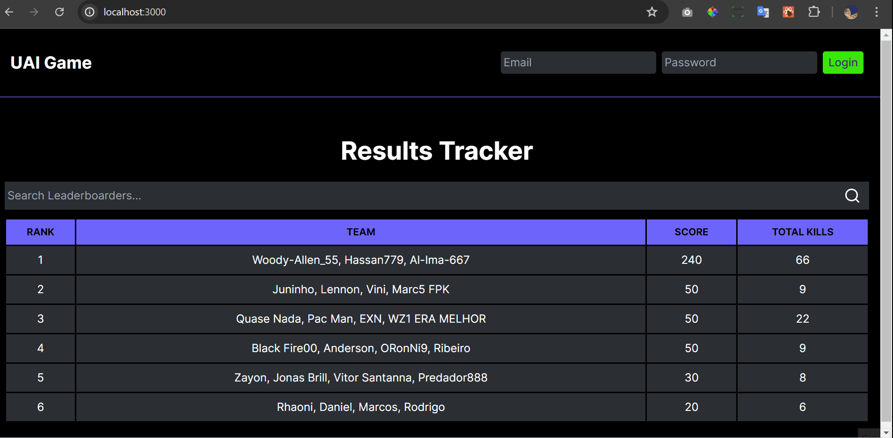
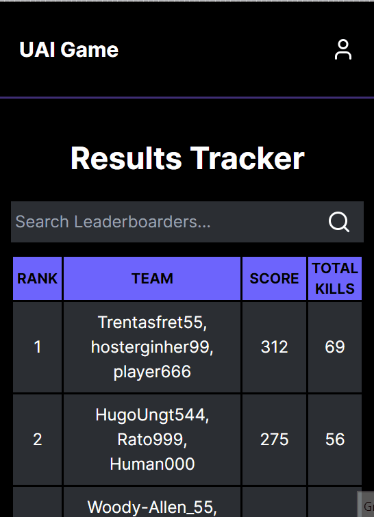

# UAI Game 🎮

This is my first real-world project, a web application designed to track and display game results for teams and players, utilizing a ranking system and search functionality. The application is built using modern web technologies and integrates with Firebase for data storage and retrieval. 

## Features 💡

- **Team and Player Ranking:** Displays a leaderboard of teams and their players, sorted by score.

- **Search Functionality:** Allows users to search for players and teams, dynamically updating the displayed results.

- **Firebase Integration:** Utilizes Firebase for data storage and real-time data fetching.

- **Authentication:** Secure admin access with Firebase authentication.
- **Responsive Design:** Ensures a seamless experience across different devices and screen sizes.

- **Admin Page:**

  - **Add Team Information:** Admins can input team details such as scores, total kills, and player names.

  - **Edit Team Information:** Admins can update scores and total kills for existing teams, automatically updating the leaderboard rankings.

## Technologies ⚙️

## Overview 💻

### screen 

### mobile 

